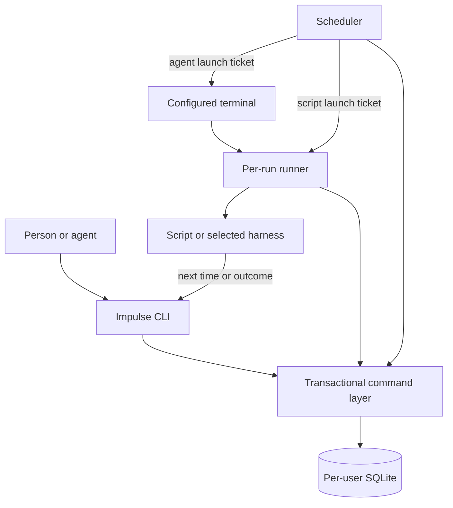

# Proposed runtime design and feasibility checks

This is an implementation proposal supporting [the review draft](spec.md). No runtime, devcontainer, dependency installation, or native launch flow has been built or tested yet.

## Shared transactional core

Use one local SQLite database per user, with a shared TypeScript command layer called by the CLI, scheduler, and runners. The scheduler is the sole logical owner of dispatch; it is not the only process allowed to record state. This is the proposed resolution of database ownership: SQLite serializes writes, and every state change uses the same validated transaction functions.

The CLI can durably record a next-time instruction or outcome even when dispatch has been deliberately stopped. Operator commands to register, update, or execute work start the scheduler as agreed. Runtime callbacks do not restart dispatch merely to record an outcome. No network listener or remote administration API is needed in v1.

Bun provides built-in SQLite and transaction support. Use WAL with full synchronous commits for acknowledged scheduling/control changes, a bounded busy wait, and explicit errors when the store cannot commit. These settings need failure-injection verification; choosing SQLite does not by itself prove the whole launch flow durable. [Bun SQLite documentation](https://bun.sh/docs/runtime/sqlite).

Proposed modules and their contracts:

| Module | Owns |
| --- | --- |
| Definition loader | TOML validation, relative paths, instruction snapshots, and useful source-location errors. |
| Command/store layer | Identity, revisions, context checks, receipts, atomic scheduling/outcome changes, and migrations. |
| Schedule planner | Nominal occurrences, next due times, catch-up, DST, elapsed intervals, and update/re-enable rules. |
| Dispatcher | Per-user ownership, run admission, agent capacity, overlap, and durable launch tickets. |
| Runner | Claiming a ticket, observing a script or harness session, script logs, and cancellation/exit evidence. |
| Harness/terminal adapters | Prompt delivery, interactive session launch, identity, liveness, retained terminal behavior, and scoped stop operations. |
| Notifications/retention | Durable notification events, delivery state, and cleanup of eligible Impulse-owned data. |

Keep platform dependencies behind these contracts. A pure scheduler test uses a fake clock and launch interface; it must not require Codex credentials, a desktop, or the real indexing project.

## Ownership, admission, and crash boundaries

Persist a scheduler lease with an owner nonce and fencing generation. Acquire/renew it transactionally; competing starts leave only one current logical owner. Every admission checks that generation in the same transaction as the state change. PID existence alone is not proof of ownership, and an expired heartbeat alone is not proof that an agent ended.

An admission transaction claims a unique occurrence, checks task revision/enable state/overlap, reserves any required agent slot, and creates a launch ticket. A runner claims that ticket once before starting work; duplicate launchers cannot execute it again. Updating a definition and admitting a run have an explicit transactional ordering, as described in the CLI contract.

The commit-to-process-start gap cannot make arbitrary external work exactly once. If a runner disappears after claiming a ticket and it is unclear whether work began, record uncertain state and hold the affected task/capacity until evidence or explicit resolution. Do not infer that it is safe to repeat an indexing submission. Only a provably unclaimed ticket can be relaunched transparently.

A new scheduler reconciles tickets, runner identities, component outcomes, and capacity before dispatching more work. A live runner continues across scheduler restarts. A machine reboot establishes different evidence from a scheduler crash and invokes the task's interruption policy. Include a boot identity, unique runner nonce, and process/session identity in evidence; never use a recycled PID to cancel an unrelated process.

Runner observations that cannot immediately be committed may be kept in an atomically written local recovery journal and replayed idempotently. This journal does not acknowledge a user scheduling command: CLI scheduling/outcome success requires the database transaction to commit. On unavailable storage, return an error with the request ID so the caller can retry safely.

Use native restart supervision where available, or a small launcher supervisor where the desktop autostart mechanism does not supervise failures. It must respect an explicit daemon stop and must not create a second dispatch owner. Runners continue recording state after an intentional dispatch stop; a later operator start or auto-starting command resumes due work.

## Execution states

Track component execution and outcome separately. A retained terminal or a harness process still available for conversation is not an active assignment once its explicit outcome has been accepted.

| State | Meaning |
| --- | --- |
| Queued | Independent request is waiting for admission. |
| Launching | Capacity and ticket claimed; actual execution is being established. |
| Running / waiting | Assigned work is active; a parent waiting on a child still uses its own slot. |
| Stopping | Cancellation requested; termination has not yet been established. |
| Succeeded / failed | Explicit outcome, or the script's recorded exit result, is known. |
| Unconfirmed | Agent execution ended without its explicit outcome. |
| Interrupted / cancelled | Work was cut short by interruption or explicit cancellation. |
| Uncertain liveness | Evidence is insufficient to say whether assigned work is still active; hold capacity and expose the condition. |

The last row is evidence status, not a fabricated success/failure outcome. Missing telemetry never creates success. Cancellation intent fences subsequent successful-completion callbacks; all late messages can remain in history but cannot undo cancellation or schedule more work.

A parent's successful outcome releases its own assignment slot, while unresolved children keep the whole run active. A cancelled run wins over later component success; otherwise known unhandled failure wins, followed by unresolved interruption/unconfirmed results, and success requires all required work to be resolved. Preserve each component's exact result even when the aggregate has another status.

An agent that exits without an outcome releases capacity only once its assigned execution is confirmed ended. A terminal closing is sufficient evidence only for an adapter whose execution actually ends with it; a shared harness service may require session-level evidence.

## Launch and cancellation boundary

Use the same executable in an internal runner mode. A terminal adapter starts a runner using a private launch descriptor; the runner invokes the selected harness in the configured working directory with an interactive console. Script runners capture stdout/stderr directly. Agent logs contain Impulse launch/lifecycle records and explicit summaries; v1 does not scrape full-screen terminal output or take ownership of harness transcripts.

Pass commands as executable/argument arrays. When a terminal requires shell text, quote only a narrow runner invocation using the target shell's rules. Supply user instructions and large context through data files, not interpolated shell source. Resolve host/container paths explicitly for wrappers and Flatpak terminals. The proposed `{launch_file}` substitution occupies an entire argument; arbitrary string interpolation is not supported.

An adapter reports capabilities for identifying the assigned execution, observing its end, preserving the terminal, requesting a clean stop, and forcing a stop. Verify those capabilities rather than silently presenting unsupported lifecycle controls. For a custom wrapper, provide the same launch descriptor and require the wrapper to keep the actual assignment observable or provide session-specific observation/stop commands.

Cancellation targets only the script/process tree or harness session owned by the run. Never kill a shared terminal application or a shared harness server to stop one assignment. If a clean-stop operation is unsupported or ineffective, remain stopping and expose the force option; do not invent successful termination. Even force requires scoped identity and positive evidence before releasing capacity.

The local Codex CLI advertises a shared app-server daemon, and local Yakuake is a Flatpak application with a reachable D-Bus session interface. These are concrete cases for the first portability spike: terminating a launcher is not automatically proof that the assigned agent ended. See [the inspected integration evidence](integration-notes.md).

## Scheduling and local state

Store canonical due timestamps, their source (`first`, `calendar`, `completion`, `explicit`, or `retry`), recurrence identity, and the revision that produced them. Store whether an occurrence was claimed, collapsed, skipped, superseded, or fulfilled. Keep effective `enabled` state separate from the portable definition.

The command layer commits next-time changes independently of eventual run outcome. A task update replaces pending timing and fences older run contexts. Completing an older snapshot may establish the current run's successful finish, but the planner uses the latest applied interval and never reinstates its old scheduling instruction. A historical run cannot move a schedule belonging to newer work.

The planner, rather than a library's default behavior, owns the agreed DST gap/fold and catch-up rules. `cron-parser` is a candidate for expression validation and iteration; its documentation covers five/six-field expressions and time zones, but its behavior still needs verification against Impulse's policy before selection. [Project documentation](https://github.com/harrisiirak/cron-parser).

Use elapsed-time evidence while running, including suspend/resume, and persist due timestamps for restart recovery. A clock reset across reboot cannot be corrected from nonexistent timing evidence; surface the actual next time and allow explicit rescheduling. The platform test matrix must establish how elapsed clocks, wall clocks, and sleep are reconciled before claiming reliable interval behavior.

Proposed user storage layout:

| Platform | Config/portable non-project definitions | Runtime state |
| --- | --- | --- |
| Linux | `$XDG_CONFIG_HOME/impulse`, falling back to `~/.config/impulse` | `$XDG_STATE_HOME/impulse`, falling back to `~/.local/state/impulse` |
| macOS | `~/Library/Application Support/Impulse/config` | `~/Library/Application Support/Impulse/state` |
| Windows | `%APPDATA%\Impulse` | `%LOCALAPPDATA%\Impulse` |

Use `settings.toml` and `tasks/` beneath the configuration root. State contains `state.sqlite`, owned run logs, private launch/context descriptors, and recovery journals. An explicit `IMPULSE_HOME` isolates all of these for tests and alternate installations. Restrict private state to its user and keep it on a local filesystem.

Schema migrations run under exclusive migration coordination, make a consistent SQLite backup including committed WAL content, and reject incompatible CLI/runner versions rather than corrupting or silently downgrading state. Retention protects current task configuration, active/unresolved execution evidence, and pending scheduling/retry controls even if old historical records are eligible for cleanup.

## Desktop startup and notifications

Proposed startup adapters are a per-user LaunchAgent on macOS, a per-user interactive logon task on Windows, and a desktop autostart entry on Linux. Apple documents user LaunchAgents, Microsoft documents logon-triggered executable actions, and the freedesktop specification defines login autostart entries. These sources establish mechanisms, not tested Impulse support. [Apple](https://developer.apple.com/library/archive/documentation/MacOSX/Conceptual/BPSystemStartup/Chapters/CreatingLaunchdJobs.html), [Microsoft](https://learn.microsoft.com/en-us/windows/win32/taskschd/starting-an-executable-when-a-user-logs-on), [freedesktop](https://specifications.freedesktop.org/autostart/latest/).

Validate login environment/PATH, native timeout and battery defaults, permissions, desktop session availability, and clean removal of only Impulse-owned entries. Platform startup configuration must not introduce an automatic work cutoff. Startup enable starts dispatch now; startup disable affects future logins only. An explicit daemon stop must not be immediately undone by supervision.

Notification events are committed independently of their delivery. A desktop delivery or custom command receives a JSON event containing IDs, task name, event type, outcome summary, and timestamps. Invoke custom commands with arguments and JSON on stdin, not shell interpolation. Do not include private run capabilities or arbitrary log contents by default.

Record failures to deliver and allow manual redelivery; delivery cannot launch a repair agent implicitly or change the work outcome. Prevent notification-command failures from recursively triggering the same notification command. Graceful shutdown of a script may still invoke that script's own application cleanup; Impulse does not own external effects already performed.

## Devcontainer and native verification

Add the devcontainer as the first implementation slice, using a digest-pinned image, pinned Bun version and development tools, a committed dependency lock, and a non-root development user. Use the same container definition in Linux CI and record the exact native toolchain version in macOS/Windows jobs. Development tests point at an isolated state directory and fixture harnesses.

The container has no automatic mount of the user's real Impulse database, harness credentials, desktop bus, or live indexing ledger. Host integration checks explicitly use an isolated installation and test workspace. No personal executables, home paths, or Flatpak assumptions belong in the general scheduler.

Before building more features, prove these interfaces with bounded prototypes and contract tests:

1. Runner survival and reconciliation when the scheduler dies at each launch boundary.
2. Scoped Codex session observation/stop and the local Flatpak Yakuake launch path.
3. Windows and macOS launch, retained terminal, callback, and cancellation behavior.
4. Calendar DST policies and elapsed timing across sleep/clock changes.
5. Single dispatch ownership, transactional command retries, and compiled SQLite behavior on each build target.

Prototype failures should change the adapter implementation or surface a capability limitation for review, rather than weakening the agreed durability or cancellation behavior silently. Exact OS versions, architecture coverage, image digests, signing, and package-manager publication require implementation evidence before release claims.
